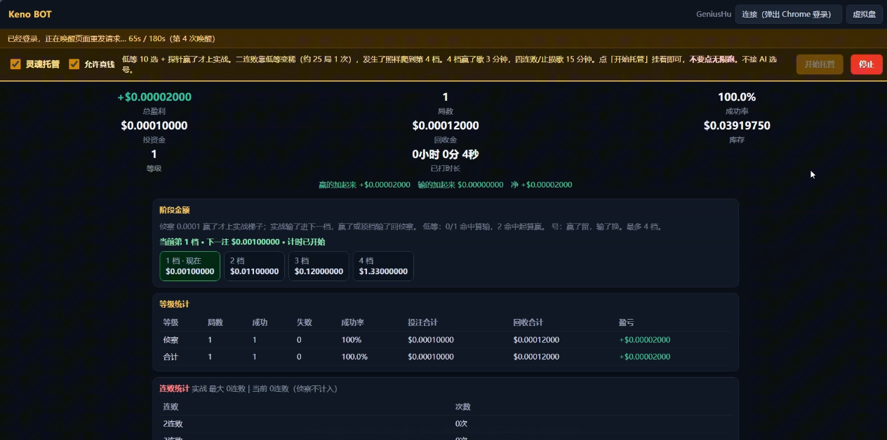

# Keno BOT

[](README.md)
[](README.zh-CN.md)
[](#)
[](README.es.md)
[](README.ru.md)
[](README.ko.md)

[](LICENSE)
[](https://www.python.org/)
[](#クイックスタート)
[](https://github.com/GeniusHu-tgty/keno-bot/actions/workflows/ci.yml)

**Keno BOT** は **Keno 専用**のローカル研究ベンチ + 自動ベットボットです。

* プラットフォームの**証明可能なフェアネス**（`server_seed` / `client_seed` / `nonce`、HMAC-SHA256）をローカルで完全再計算し、公式計算機とバイト単位で一致することを 1 コマンドで自己証明できます。
* 公式の **40 通りの配当表**を 1 行ずつ監査します（実測 RTP 98.65% – 99.07%）。
* **帰無モデル**（公平な超幾何分布）で戦略を測定し、収益のスクリーンショットではなく**結果分布の形**を見せます。
* 自分でスイッチを入れた場合に限り、**自分の Chrome**（CDP）経由で**自分のアカウント**を自動操作できます。既定は完全シミュレーションで、リアルマネーは明示的に有効化が必要です。

Keno だけ。予測もしない、AI による番号選びもしない、利益を約束しない。

[](docs/media/keno-bot-demo.mp4)

*▶ サムネイルをクリックすると 89 秒のデモが再生されます（mp4、25 MB）。*

---

## よくある Keno スクリプトとの違い

| よくあるスクリプト | Keno BOT |
| --- | --- |
| 金槌：ホットナンバー、コールド追い、マーチンゲール | まず物差し：1 ベットの RTP・分散・期待値がローカルで計算できる |
| 配当は伝聞 | 公式 40 通りを 1 行ずつ再計算し、自作表との差分を一覧化 |
| RNG は「プラットフォームを信じる」しかない | HMAC-SHA256 のシード連鎖をローカルで再計算し、公式計算機とバイト一致 |
| 証拠はスクリーンショット | 全モードに完全な台帳：賭け金、払戻、ドローダウン、連敗、分位点 |
| 手動クリックのみ | 階段マネー + セッション規律 + スライス冷却 + 損切/利確、全自動・無人運転可 |

## クイックスタート

### A. exe をそのまま実行（Python 不要）

1. [Releases](../../releases) から `KenoBOT.exe` をダウンロード。
2. ダブルクリック。`127.0.0.1` にローカルページを立て、ブラウザを自動で開きます。
3. 2 つの画面：`/` は練習ベンチ（完全シミュレーション）、`/live` はライブデスク（接続してスイッチを入れた時だけ実際の資金が動きます）。

初回起動時に `%LOCALAPPDATA%\KenoBOT` を作り、状態・ログ・レポートを保管します。レジストリもサービスも使いません。フォルダを消せば完全に消去されます。

### B. ソースから実行（開発者向け）

```bash
git clone <your-fork-url> keno-bot && cd keno-bot
python -m pip install -e .
python keno_bot_app.py        # python -m keno.cli serve と同じ
```

Windows ではルートの `启动.bat` をダブルクリックでも起動できます（`dist\KenoBOT.exe` があればそれを、無ければローカルの Python を使います）。

### C. 自分で exe を作る

```powershell
powershell -ExecutionPolicy Bypass -File build_exe.ps1            # 単一ファイル dist\KenoBOT.exe
powershell -ExecutionPolicy Bypass -File build_exe.ps1 -Onedir   # ディレクトリ版（起動が速い）
powershell -ExecutionPolicy Bypass -File tools\make_release.ps1  # exe + ドキュメント -> dist\KenoBOT-<version>-win64.zip
```

## ライブデスクの接続方法（リアルマネー、既定はオフ）

Keno BOT はアカウント情報を保存しません。ログイン用の独自画面も持っていません。やることは 1 つだけ：**すでにログイン済みの** Chrome に接続し（Chrome DevTools Protocol）、ページ自身のリクエストからセッショントークンを取得し（メモリ内のみ、ディスクには書きません）、人間と同じようにベットボタンを押します。

```bash
# 1) デバッグポート付きで Chrome を起動（自分のプロファイルを使う）
chrome.exe --remote-debugging-port=9222 --user-data-dir=%USERPROFILE%\keno-chrome-profile

# 2) この Chrome で手動ログインし、Keno ページを開く

# 3) 読み取り専用の確認（接続して状態を見るだけ、ベットしない）
python -m keno.cli live connect --cdp http://127.0.0.1:9222

# 4) 実際にベットする時だけ --live-bets を付け、最小額から
python -m keno.cli live run --cdp http://127.0.0.1:9222 --live-bets --risk low --pick-count 10 --rounds 20
```

`KENO_CHROME_PROFILE` / `KENO_CHROME_PS1` で Chrome のプロファイルと起動スクリプトを指定できます。未指定なら `~/.keno-bot/` 配下の既定値を使います。

規律はドキュメントではなくコードに書かれています：1 ベット上限、階段の段数、2 連敗で降段、4 段目で強制休憩、損切/利確、スライス冷却、1 日の上限。まず練習ベンチでパラメータを慣らしてからリアルマネーを考えてください。


## 検証可能なフェアネス（バイト単位のローカル再計算）

各ラウンドは 3 つの公開量から再現できます：`server_seed`（先にハッシュが公開され、後に種が明かされる）、`client_seed`（変更可能）、`nonce`（ラウンド番号）。

```bash
# リポジトリ同梱の自己証明サンプル（240 ラウンド、種はこのリポジトリ内のみ）
python -m keno.cli verify-rounds --replay-file data/samples/rounds_sample.jsonl --seeds-file data/samples/seeds_sample.json
```

`240/240 rounds PASS` が出れば合格です。種を 1 文字変えると即 FAIL になります——これが「本当に検証している」証拠です。

## 配当表の監査

| 区分 | 実測 RTP |
| --- | --- |
| low、10 通り選択 | 98.76% |
| 全 40 組み合わせ | 98.65% – 99.07% |

自作の `configs/payout.yaml` と公式表は 5/6/7/8/9 ヒットで差があります。全一覧は `reports/payout_audit.md`。自分で再計算するには：

```bash
python -m keno.cli audit-payouts --paytable configs/payout.yaml --official data/reference/stake_keno_payouts_official.json
```

## このツールが測るもの

* **任意の区分の期待値**：`払戻 × P(ヒット) − 賭け金`。超幾何分布から直接計算でき、シミュレーション不要。
* **資金戦略の分散とドローダウン**：公平な抽選でのモンテカルロ。乱数シード固定で再現可能。
* **連敗とヒット分布**：理論値との比較（ヒットのヒストグラムにカイ二乗検定）。
* **パラメータ凍結検証**：あるデータで調整したパラメータを、未見のシード素材で再生し、ノイズを覚えていないか確認。

Keno はどの区分でも払戻が賭け金を下回ります。資金管理が変えられるのは結果分布の**形**（ドローダウン、破綻速度、ボラティリティ）だけで、符号は変わりません。このリポジトリの価値はそれを物語ではなく数字で示すことです。

## ディレクトリ構成

```text
keno_bot_app.py           ランチャー / PyInstaller エントリ
build_exe.ps1             exe ビルド
configs/                  game.yaml（盤面・RNG プロトコル） payout.yaml（自作配当） bot_phase.yaml（階段パラメータ）
data/reference/           公式配当表
data/samples/             自己証明サンプル
src/keno/provably_fair/   HMAC-SHA256・浮動小数点生成・ラウンド検証
src/keno/game/            抽選、ヒット、配当、精算
src/keno/bot/             ボット：資金、階段状態機、組み合わせ戦略、台帳、CDP/ライブ実行
src/keno/research/        モンテカルロ、パラメータ凍結検証、リスクグリッド
src/keno/reporting/       指標（超幾何、カイ二乗、ドローダウン、連敗）とレポート出力
src/keno/webapp/          ローカル作業台（HTTP サーバ + ページ）
tools/                    サンプル生成、アイコン生成、リリース作成
docs/                     アーキテクチャ、検証方法、中国語クイックスタート
tests/                    pytest（110 件）
```

## ロードマップ（PR 歓迎）

* **スクリプト式戦略プラグイン**：外部戦略向けの安定したフック（毎ラウンド履歴と残高を受け取り、picks と額を返す）。
* **BET_LIST 突合**：ベット失敗・タイムアウト後に注文一覧から照合して補帳する。
* **英語 UI**：静的ページの文言は現在中国語が中心。i18n 化して海外の貢献者に優しく。
* **データ検証**：`data/**/*.jsonl` に JSON Schema と `collect` 側のフィールド検査を追加。
* **クロスプラットフォーム化**：個人パスを `keno/paths.py` と環境変数に集約（macOS/Linux の Chrome 起動対応）。
* **WebSocket データソース実装**：`src/keno/bot/ws.py` は現在骨組みのみ。

## 免責

Keno は負の期待値のゲームです。本リポジトリは研究・エンジニアリングの実践であり、予測はせず、結果を約束しません。失っても困らない金額だけを使い、お住まいの地域の法令とプラットフォーム規約に従ってください。

## ライセンス

**GNU General Public License v2.0**、[`LICENSE`](LICENSE) を参照。Copyright (C) 2026 GeniusHu-tgty。ライセンス原文どおり無保証です。使用・研究・共有・改変（商用含む）は自由ですが、改変版を配布する場合は GPL のままソースを添付する必要があります。
