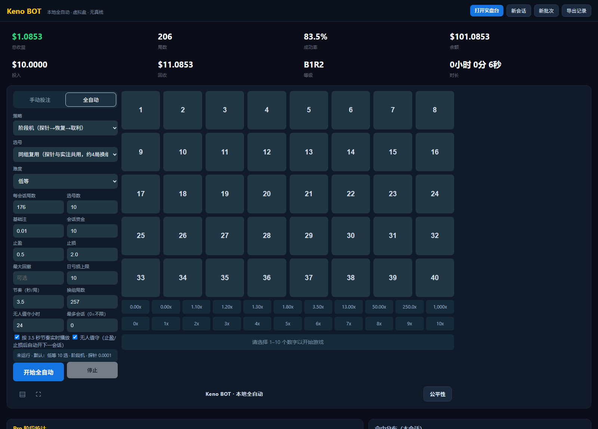

# Keno BOT

[](README.md)
[](README.zh-CN.md)
[](README.ja.md)
[](README.es.md)
[](README.ru.md)
[](#)

[](LICENSE)
[](https://www.python.org/)
[](#%EB%B9%A0%EB%A5%B8-%EC%8B%9C%EC%9E%91)
[](CONTRIBUTING.md)

**Keno BOT** 은 **Keno 전용** 로컬 연구 벤치이자 자동 베팅 봇입니다.

* 플랫폼의 **검증 가능한 공정성** 체인(`server_seed` / `client_seed` / `nonce`, HMAC-SHA256)을 로컬에서 완전히 재계산하고, 공식 계산기와 바이트 단위로 일치하는지 명령 하나로 스스로 증명합니다.
* 공식 **40개 배당 조합**을 한 줄씩 감사합니다(실측 RTP 98.65% – 99.07%).
* **귀무 모델**(공정한 초기하 분포)로 전략을 측정해, 수익 스크린샷이 아니라 **결과 분포의 모양**을 보여줍니다.
* 직접 스위치를 켠 경우에만 **본인의 Chrome**(CDP)을 통해 **본인 계정**을 자동 조작합니다. 기본값은 순수 시뮬레이션이며 실제 자금은 명시적으로 켜야 합니다.

Keno만 다룹니다. 예측도, AI 번호 선택도, 수익 약속도 없습니다.



---

## 흔한 Keno 스크립트와 다른 점

| 흔한 스크립트 | Keno BOT |
| --- | --- |
| 망치: 핫 넘버, 콜드 추격, 마틴게일 | 먼저 자: 단일 베팅 RTP, 분산, 기대값을 로컬에서 계산 |
| 배당은 입소문 | 공식 40개 조합을 직접 재계산하고 자체 표와 차이를 대조 |
| 난수는 «플랫폼을 믿는» 수밖에 | HMAC-SHA256 시드 체인을 로컬에서 바이트 단위로 재계산 |
| 증거는 스크린샷 | 모든 모드에 완전한 장부: 투입, 회수, 낙폭, 연패, 분위수 |
| 수동 클릭뿐 | 계단 자금 + 세션 규율 + 구간 휴식 + 손절/익절, 완전 자동·무인 운용 |

## 빠른 시작

### A. exe 실행 (Python 불필요)

1. [Releases](../../releases)에서 `KenoBOT.exe`를 내려받습니다.
2. 더블클릭하면 `127.0.0.1`에 로컬 페이지가 뜨고 브라우저가 자동으로 열립니다.
3. 화면 두 개: `/`는 훈련 벤치(순수 시뮬레이션), `/live`는 실전 데스크(연결하고 스위치를 켠 뒤에만 실제 자금이 움직입니다).

첫 실행 시 `%LOCALAPPDATA%\KenoBOT`을 만들어 상태·로그·리포트를 보관합니다. 레지스트리도 서비스도 건드리지 않으며, 폴더를 지우면 완전히 사라집니다.

### B. 소스로 실행 (개발자)

```bash
git clone <your-fork-url> keno-bot && cd keno-bot
python -m pip install -e .
python keno_bot_app.py        # python -m keno.cli serve 와 동일
```

Windows에서는 루트의 `启动.bat`을 더블클릭해도 됩니다(`dist\KenoBOT.exe`가 있으면 그것을, 없으면 로컬 Python을 사용).

### C. 직접 exe 빌드

```powershell
powershell -ExecutionPolicy Bypass -File build_exe.ps1            # 단일 파일 dist\KenoBOT.exe
powershell -ExecutionPolicy Bypass -File build_exe.ps1 -Onedir   # 폴더 버전, 실행이 더 빠름
powershell -ExecutionPolicy Bypass -File tools\make_release.ps1  # exe + 문서 -> dist\KenoBOT-<version>-win64.zip
```

## 실전 데스크 연결 (실제 자금, 기본 꺼짐)

Keno BOT는 계정 정보를 저장하지 않고 자체 로그인 화면도 없습니다. 하는 일은 하나입니다. **이미 로그인된** Chrome에 연결해(Chrome DevTools Protocol) 페이지 자체 요청에서 세션 토큰을 가져오고(메모리만, 디스크 기록 없음), 사람처럼 베팅 버튼을 누릅니다.

```bash
# 1) 디버그 포트로 Chrome 실행 (본인 프로필 사용)
chrome.exe --remote-debugging-port=9222 --user-data-dir=%USERPROFILE%\keno-chrome-profile

# 2) 이 Chrome에서 직접 로그인하고 Keno 페이지 열기

# 3) 읽기 전용 점검: 연결해서 상태만 확인, 베팅 없음
python -m keno.cli live connect --cdp http://127.0.0.1:9222

# 4) 실제로 베팅할 때만 --live-bets 를 붙이고 최소 금액부터
python -m keno.cli live run --cdp http://127.0.0.1:9222 --live-bets --risk low --pick-count 10 --rounds 20
```

`KENO_CHROME_PROFILE` / `KENO_CHROME_PS1` 로 Chrome 프로필과 실행 스크립트를 지정할 수 있습니다. 지정하지 않으면 `~/.keno-bot/` 아래 기본값을 씁니다.

규율은 문서가 아니라 코드에 있습니다: 베팅 상한, 계단 단계, 2연패 시 강등, 4단계 승리 후 강제 휴식, 손절/익절, 구간 쿨다운, 일일 한도.


## 검증 가능한 공정성 (바이트 단위 로컬 재계산)

모든 라운드는 세 가지 공개 값으로 재현됩니다: `server_seed`(해시 먼저 공개, 이후 시드 공개), `client_seed`(변경 가능), `nonce`(라운드 번호).

```bash
# 저장소에 포함된 자기 증명 샘플 (240 라운드, 시드는 이 저장소에만 존재)
python -m keno.cli verify-rounds --replay-file data/samples/rounds_sample.jsonl --seeds-file data/samples/seeds_sample.json
```

기대 출력은 `240/240 rounds PASS` 입니다. 시드를 한 글자만 바꿔도 즉시 FAIL — 이것이 실제로 검증한다는 증거입니다.

## 배당표 감사

| 구분 | 실측 RTP |
| --- | --- |
| low, 10개 선택 | 98.76% |
| 전체 40개 조합 | 98.65% – 99.07% |

자체 표 `configs/payout.yaml`과 공식 표는 5/6/7/8/9 적중에서 차이가 있습니다. 전체 목록은 `reports/payout_audit.md` 에 있습니다. 직접 재계산하려면:

```bash
python -m keno.cli audit-payouts --paytable configs/payout.yaml --official data/reference/stake_keno_payouts_official.json
```

## 이 도구가 측정하는 것

* **임의 구분의 기대값**: `배당 × P(적중) − 베팅`, 초기하 분포로 직접 계산하며 시뮬레이션이 필요 없습니다.
* **자금 전략의 분산과 낙폭**: 공정 추첨에 대한 몬테카를로, 난수 시드 고정으로 재현 가능.
* **연패와 적중 분포**: 이론값과 비교(적중 히스토그램에 카이제곱 검정).
* **파라미터 동결 검증**: 한 구간에서 맞춘 파라미터를 보지 못한 시드 자료로 재생해 노이즈를 외우지 않았는지 확인.

Keno는 모든 구분에서 배당이 베팅보다 적습니다. 자금 관리는 결과 분포의 **모양**(낙폭, 파산 속도, 변동성)만 바꾸고 부호는 바꾸지 못합니다. 이 저장소의 가치는 그것을 이야기가 아니라 숫자로 보여주는 데 있습니다.

## 디렉터리 구조

```text
keno_bot_app.py           런처 / PyInstaller 엔트리
build_exe.ps1             exe 빌드
configs/                  game.yaml(보드, RNG 프로토콜) payout.yaml(자체 배당) bot_phase.yaml(계단 파라미터)
data/reference/           공식 배당표
data/samples/             자기 증명 샘플
src/keno/provably_fair/   HMAC-SHA256, 부동소수 생성, 라운드 검증
src/keno/game/            추첨, 적중, 배당, 정산
src/keno/bot/             봇: 자금, 단계 기계, 조합 전략, 장부, CDP/실전 실행
src/keno/research/        몬테카를로, 동결 검증, 리스크 그리드
src/keno/reporting/       지표(초기하, 카이제곱, 낙폭, 연패)와 리포트 내보내기
src/keno/webapp/          로컬 작업대(HTTP 서버 + 페이지)
tools/                    샘플·아이콘 생성, 릴리스 패키징
docs/                     아키텍처, 검증 방법, 중국어 빠른 시작
tests/                    pytest(110개)
```

## 로드맵 (PR 환영)

* **스크립트형 전략 플러그인**: 외부 전략용 안정적인 훅(매 라운드 기록과 잔고를 받아 picks와 금액을 반환).
* **BET_LIST 대조**: 베팅 실패·타임아웃 후 플랫폼 베팅 목록으로 장부를 맞춤.
* **영문 UI**: 정적 페이지 문구가 현재 중국어 중심이라 i18n으로 해외 기여자를 배려.
* **데이터 검증**: `data/**/*.jsonl` 에 JSON Schema 와 `collect` 필드 검사 추가.
* **크로스 플랫폼 정리**: 개인 경로를 `keno/paths.py` 와 환경 변수로 모으고 macOS/Linux Chrome 실행 지원.
* **WebSocket 데이터 소스 구현**: `src/keno/bot/ws.py` 는 현재 골격만 있음.

## 면책

Keno는 음의 기대값 게임입니다. 이 저장소는 연구·엔지니어링 프로젝트로, 측정을 할 뿐 예측하지 않으며 결과를 약속하지 않습니다. 잃어도 괜찮은 돈만 사용하고, 거주 지역의 법률과 플랫폼 약관을 따르세요.

## 라이선스

**GNU General Public License v2.0**, [`LICENSE`](LICENSE) 참조. Copyright (C) 2026 GeniusHu-tgty. 라이선스 원문대로 어떠한 보증도 제공하지 않습니다. 사용·연구·공유·수정(상업적 이용 포함)은 자유이며, 수정판을 배포할 경우 GPL을 유지하고 소스를 함께 제공해야 합니다.
