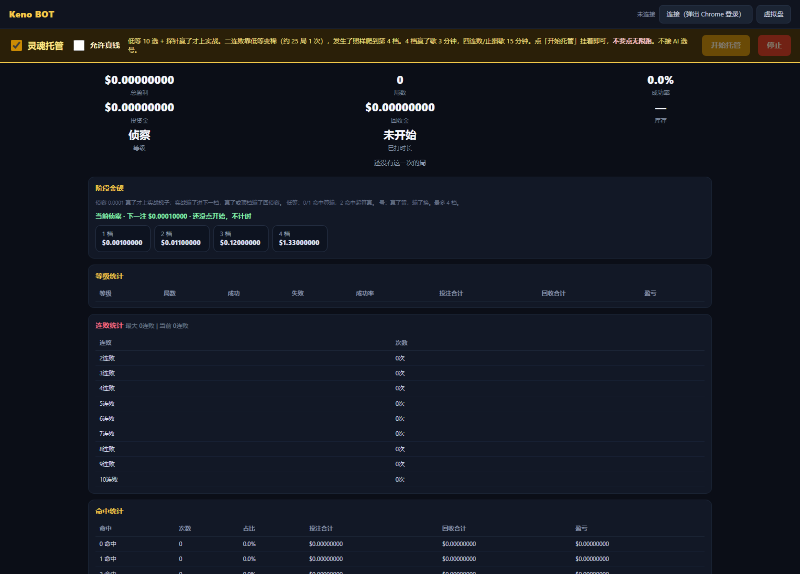

# Keno BOT

[](#)
[](README.zh-CN.md)
[](README.ja.md)
[](README.es.md)
[](README.ru.md)
[](README.ko.md)

[](LICENSE)
[](https://www.python.org/)
[](#quickstart)
[](https://github.com/GeniusHu-tgty/keno-bot/actions/workflows/ci.yml)

**Keno BOT** is a local, replayable **Keno** workbench and betting bot.

* It re-derives every draw from the published provably-fair chain (`server_seed` / `client_seed` / `nonce`, HMAC-SHA256) — byte for byte, with a verifier you can run in one command.
* It audits the platform's 40-tier payout table instead of trusting it (every tier recomputed, 98.65% – 99.07%).
* It measures staking policies against a **null model** (fair hypergeometric draws), so you see the shape of the outcome distribution instead of a sales pitch.
* It can drive **your own** account through **your own Chrome** over CDP — paper mode is the default, live betting sits behind an explicit flag.

Keno only. No prediction models, no AI number picking, no profit promises.

https://github.com/user-attachments/assets/ee8b89d7-a21f-47ef-ac36-9fbfe05c36ed

*▶ Click the player above for the 89-second demo (mp4). If no player shows up: [open the video](https://github.com/user-attachments/assets/ee8b89d7-a21f-47ef-ac36-9fbfe05c36ed).*

---

## Why not just another Keno script

| The usual script | Keno BOT |
| --- | --- |
| A hammer: hot numbers, cold numbers, martingale | A ruler first: per-bet RTP, variance and expected value are computed locally |
| Payout odds from hearsay | All 40 official tiers recomputed, differences against the built-in table listed one by one |
| The RNG is taken on faith | The HMAC-SHA256 chain is replayed locally and matches the official calculator byte for byte |
| A screenshot as evidence | A full ledger for every mode: turnover, returns, drawdown, losing streaks, percentiles |
| Manual clicking | Staking ladder + session discipline + slice cooldown + stop-loss / take-profit, unattended if you want |

## Quickstart

### A. Run the Windows binary (no Python needed)

1. Download `KenoBOT.exe` from [Releases](../../releases).
2. Double-click it. It serves a page on `127.0.0.1` and opens your browser.
3. Two workbenches: `/` = the simulator (paper only) and `/live` = the live desk (real money needs your account plus the explicit toggle).

The first run creates `%LOCALAPPDATA%\KenoBOT` for state, logs and reports. No registry writes, no service, no installer — delete the folder to wipe it.

### B. Run from source (developers)

```bash
git clone <your-fork-url> keno-bot && cd keno-bot
python -m pip install -e .
python keno_bot_app.py        # same as: python -m keno.cli serve
```

On Windows you can also double-click `启动.bat`: it launches `dist\KenoBOT.exe` when present, otherwise the local Python app.

### C. Build your own exe

```powershell
powershell -ExecutionPolicy Bypass -File build_exe.ps1            # single file: dist\KenoBOT.exe
powershell -ExecutionPolicy Bypass -File build_exe.ps1 -Onedir   # folder build, faster start
powershell -ExecutionPolicy Bypass -File tools\make_release.ps1  # exe + docs -> dist\KenoBOT-<version>-win64.zip
```

The build script generates the icon (`tools/make_icon.py`) and the self-test sample (`tools/make_sample.py`) when needed, and installs PyInstaller if it is missing.

## Live desk (real money, off by default)

Keno BOT never stores your password and ships no login endpoint. It attaches to a Chrome instance **you** are already logged into (Chrome DevTools Protocol), reads the session token out of the page's own requests (in memory only, never written to disk) and then clicks the bet button like a human.

```bash
# 1) start Chrome with a debugging port, using a profile you own
chrome.exe --remote-debugging-port=9222 --user-data-dir=%USERPROFILE%\keno-chrome-profile

# 2) log in inside that Chrome and open the Keno page

# 3) read-only check: connect and report state, no bets
python -m keno.cli live connect --cdp http://127.0.0.1:9222

# 4) only when you mean it: add --live-bets, and start with the minimum stake
python -m keno.cli live run --cdp http://127.0.0.1:9222 --live-bets --risk low --pick-count 10 --rounds 20
```

`KENO_CHROME_PROFILE` and `KENO_CHROME_PS1` point at your Chrome profile and launcher script; without them a default under `~/.keno-bot/` is used.

Discipline lives in the code, not in this document: per-bet cap, ladder levels, two-loss step-down, forced break after a level-4 win, stop-loss / take-profit, slice cooldown and a daily cap. Tune it on the simulator before you connect anything real.



## Provably fair, verified locally

Every round is reproducible from three public values: `server_seed` (hashed up front, revealed later), `client_seed` (yours) and `nonce` (round index). Keno BOT implements that chain down to the byte:

```bash
# self-contained sample shipped with the repo (240 rounds)
python -m keno.cli verify-rounds \
  --replay-file data/samples/rounds_sample.jsonl \
  --seeds-file  data/samples/seeds_sample.json
```

Expect `240/240 rounds PASS` plus a hit-rate comparison. Flip one bit in a seed and it fails immediately — that is how you know the check is real. Rounds captured from a live session replay the same way and match the official calculator byte for byte.

## Payout-table audit

`data/reference/stake_keno_payouts_official.json` holds the 40 official tiers; the audit script recomputes each one from the game's combinatorics:

| Tier family | Measured RTP |
| --- | --- |
| low, 10 picks | 98.76% |
| every tier, 40 combinations | 98.65% – 99.07% |

The built-in table in `configs/payout.yaml` differs from the official one on the 5/6/7/8/9-hit tiers; the full list is in `reports/payout_audit.md`. Recompute it yourself:

```bash
python -m keno.cli audit-payouts --paytable configs/payout.yaml --official data/reference/stake_keno_payouts_official.json
```

## What the tool measures

* **Expected value** of any tier: `payout × P(hits) − stake`, from the hypergeometric distribution — no simulation required.
* **Variance and drawdown** of a staking policy, by Monte-Carlo over fair draws, with a fixed seed so results are reproducible.
* **Losing streaks** and hit distributions compared against theory (χ² over the hit histogram).
* **Parameter-free validation**: a policy tuned on one period is replayed on unseen seed material to check that it does not simply memorise noise.

Two facts follow from the game itself, not from this software: Keno pays back less than it takes in on every tier, and money management changes the *shape* of the outcome distribution (drawdown, ruin speed, variance) — never its sign. This repository exists to make that measurable instead of rhetorical.

## Project layout

```text
keno_bot_app.py            launcher / PyInstaller entry point
build_exe.ps1              build the Windows binary
configs/                   game.yaml (board, RNG protocol), payout.yaml (built-in table), bot_phase.yaml (ladder)
data/reference/            official payout table
data/samples/              self-contained verification sample
src/keno/provably_fair/    HMAC-SHA256 stream, float generator, per-round verifier
src/keno/game/             draws, hits, payouts, settlement
src/keno/bot/              the bot: money management, phase machine, combo strategy, ledger, CDP / live execution
src/keno/research/         Monte-Carlo, parameter-freezing validation, risk grid
src/keno/reporting/        metrics (hypergeometric, chi-square, drawdown, streaks) and report export
src/keno/webapp/           local workbench (HTTP server + static pages)
tools/                     sample/icon generation, release packaging
docs/                      architecture, verification method, quick start (zh)
tests/                     pytest suite (110 tests)
```

Where state lives: the exe writes to `%LOCALAPPDATA%\KenoBOT`, a source checkout writes to `data/webapp/`, and `KENO_BOT_HOME` overrides both.

## Roadmap (PRs welcome)

* **Script-style strategy plugins** — a stable per-round hook (history + bankroll in, picks + stake out) so selection logic can be contributed without touching the core.
* **Bet-list reconciliation** — after a failed or timed-out bet, look the wager up in the platform's own bet list instead of trusting nonce/balance deltas.
* **English UI** — the static pages are still mostly Chinese; i18n them.
* **Data contracts** — JSON Schema for `data/**/*.jsonl` plus field assertions in `collect`, so malformed rows are rejected at the source.
* **Cross-platform paths** — funnel every path through `keno/paths.py` + env vars (`KENO_CHROME_PROFILE`, `KENO_CHROME_PS1`, `KENO_BOT_HOME`) and support launching Chrome on macOS/Linux.
* **A real WebSocket feed** — `src/keno/bot/ws.py` is a skeleton; make it the primary data source instead of polling.

See `CONTRIBUTING.md` for good first issues with reproduction steps and acceptance criteria.

## Disclaimer

Keno is a game with negative expectation. This is a research and engineering project: it measures, it does not predict, and it promises nothing. Only play with money you can afford to lose, and follow the law and the platform terms that apply to you.

## License

**GNU General Public License v2.0** — see [`LICENSE`](LICENSE). Copyright (C) 2026 GeniusHu-tgty. There is no warranty, as stated in the license. You may use, study, share and modify this software, including commercially; if you distribute a modified version it must stay under the GPL and ship its source.
